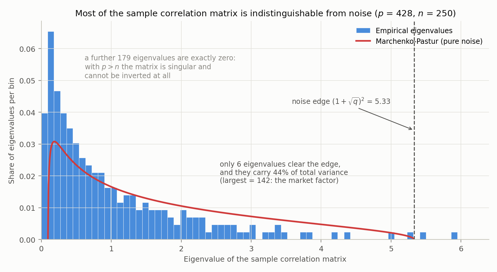
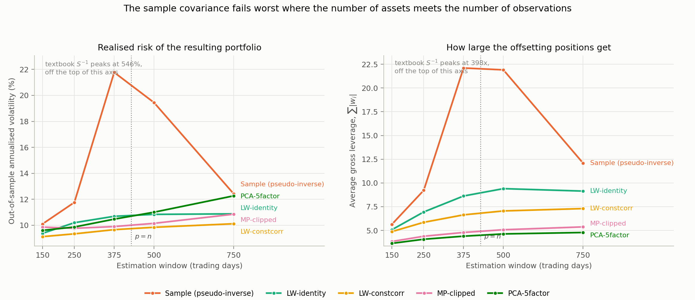
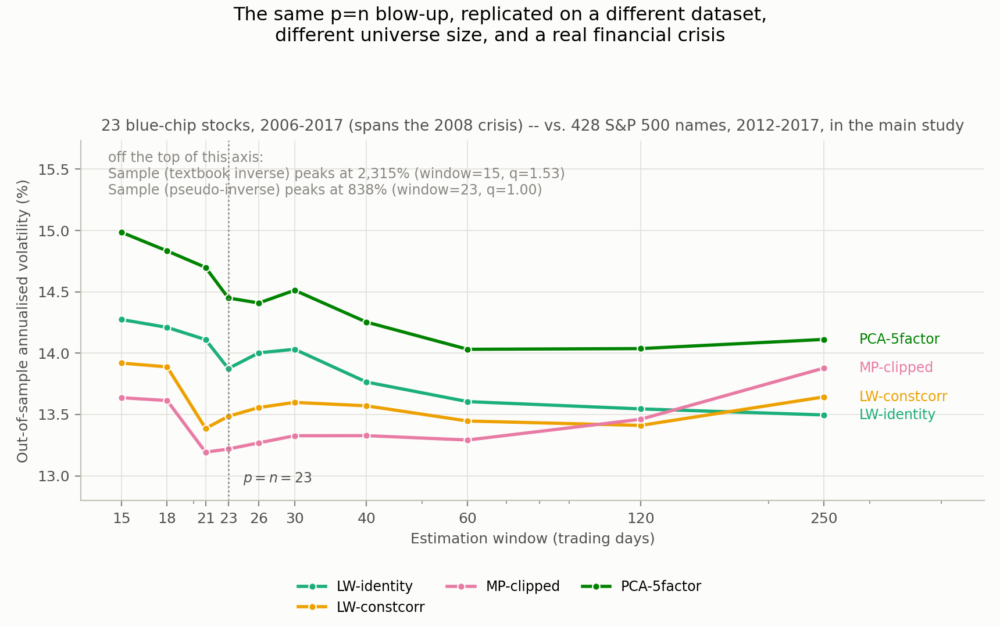

# Robust Covariance Estimation for Portfolio Construction

Estimating a covariance matrix for 428 stocks from 250 days of returns means
fitting 91,806 parameters to 107,000 numbers. The estimate is mostly noise,
and mean-variance optimisation inverts it — loading the portfolio onto
precisely the directions that are least reliable.

This project implements four standard fixes for that problem, and measures
what each is worth in a walk-forward backtest that is checked for look-ahead
bias mechanically rather than by inspection.

```
src/robustcov/     shrinkage, random-matrix filtering, factor models,
                   portfolio optimisers, walk-forward engine
scripts/           reproduce every number and figure in this README
tests/             55 tests: mathematical properties + a no-look-ahead check
```

---

## The problem, measured

Take the first 250 trading days of the panel: 428 assets, so `q = p/n = 1.71`.
If the assets were pure independent noise, the eigenvalues of their sample
correlation matrix would fall inside the Marchenko–Pastur support. Comparing
the real spectrum to that theoretical band says how much of the matrix carries
information:



- **179 eigenvalues are exactly zero.** Theory predicts an atom at zero of mass
  `1 − 1/q`, which is 178.0 of them. The matrix is singular and cannot be
  inverted at all.
- **Only 6 of 428 eigen-directions clear the noise edge**, and those 6 carry
  44% of total variance.
- The largest is 141.9 — 33% of total variance on its own. That is the market
  factor.

Everything between those two facts is the estimation problem.

## What is implemented

| Estimator | Idea | Reference |
|---|---|---|
| `sample_covariance` | The MLE baseline. Singular whenever `p ≥ n`. | — |
| `ledoit_wolf_identity` | Shrink toward a scaled identity; optimal intensity in closed form. | Ledoit & Wolf (2004) |
| `ledoit_wolf_constant_correlation` | Shrink toward a target that keeps each variance but averages all correlations. | Ledoit & Wolf (2003) |
| `marchenko_pastur_clipped` | Flatten every eigenvalue below the RMT noise edge, preserving the trace. | Laloux et al. (2000) |
| `pca_factor_model` | Low-rank plus diagonal: `k` principal components as statistical factors. | — |

Portfolio rules: unconstrained minimum variance, long-only minimum variance
(accelerated projected gradient on the simplex), equal risk contribution
(cyclical coordinate descent), inverse variance, and 1/N.

No expected returns are used anywhere. Errors in the mean dominate errors in
the covariance for mean-variance portfolios (Chopra & Ziemba, 1993), so
holding returns out isolates the question actually being asked.

## Results

428 US large caps, August 2012 – August 2017. 250-day estimation window,
monthly rebalancing, 10 bps of one-way transaction cost, everything strictly
out of sample.

**Unconstrained minimum variance:**

| Estimator | Ann. vol | Sharpe | Max DD | Turnover | Leverage | Short |
|---|---:|---:|---:|---:|---:|---:|
| Sample (pseudo-inverse) | 11.77% | −0.04 | −17.4% | 8.10 | 9.2× | 411% |
| LW-identity | 10.20% | 0.29 | −14.7% | 3.36 | 7.0× | 297% |
| LW-constcorr | **9.34%** | 0.67 | −12.6% | 2.24 | 5.9× | 243% |
| MP-clipped | 9.77% | 0.92 | −8.6% | 1.28 | 4.4× | 169% |
| PCA-5factor | 9.87% | **1.14** | **−7.9%** | **1.03** | **4.1×** | **154%** |
| *1/N benchmark* | *12.84%* | *0.65* | *−19.2%* | *0* | *1.0×* | *0%* |

Best out-of-sample risk goes to constant-correlation shrinkage: **9.34% vs
12.84% for 1/N**, a 27% reduction. But the more useful column is leverage. The
sample estimator's portfolio holds 411% short exposure and turns over 8× its
book every month; after costs its Sharpe is negative. It is not a portfolio
anyone could run. The regularised estimators are between two and eight times
cheaper to trade.

### The result that matters most

Sweeping the estimation window varies `q = p/n`, the one parameter governing
how noisy the sample estimate is:



The sample estimator's out-of-sample risk **peaks at a 375-day window** —
21.8% volatility, 22× leverage — and improves on either side. That is exactly
where `p ≈ n`. Random matrix theory says the smallest eigenvalues collapse
toward zero as `q → 1`, so inverting is worst there; with a shorter window the
matrix is so rank-deficient that the pseudo-inverse throws away the bad
directions entirely, which is accidental regularisation. Every regularised
estimator stays between 9.1% and 12.3% across the whole sweep.

Coding the textbook formula `Σ⁻¹1 / 1ᵀΣ⁻¹1` with `numpy.linalg.inv` and no
safeguards, on the same singular matrices, gives **546% annualised volatility
at 398× leverage**. `inv()` does not raise on a singular matrix; it returns
numbers. This is included in the sweep as its own row.

### The finding that argues against the whole exercise

Repeat everything with a no-shorting constraint and the estimators become
nearly indistinguishable — 9.56% to 9.71% annualised volatility, a spread of
0.15 percentage points against 2.43 in the unconstrained case:

| Estimator | Unconstrained | Long-only |
|---|---:|---:|
| Sample | 11.77% | 9.67% |
| LW-identity | 10.20% | 9.60% |
| LW-constcorr | 9.34% | 9.56% |
| MP-clipped | 9.77% | 9.71% |
| PCA-5factor | 9.87% | 9.58% |

This reproduces Jagannathan & Ma (2003): a no-shorting constraint is
*mathematically equivalent* to shrinking the covariance matrix, so it does the
regularisation work already. The honest conclusion is that sophisticated
covariance estimation earns its keep in unconstrained or leveraged books, and
buys very little in a long-only one. Forbidding short sales even rescues the
raw sample estimate, from 11.77% to 9.67%.

## Robustness: a second dataset, spanning the 2008 crisis

Everything above uses one dataset and one regime — August 2012 to August
2017, a calm bull market. `scripts/05_crisis_robustness.py` runs the same
methodology on a second, independent panel — 23 blue-chip stocks with
complete daily history from January 2006 to December 2017
(`data/processed/blue_chip_2006_2018.csv.gz`) — chosen specifically because
it spans the NBER-dated December 2007 to June 2009 recession in full.

**Question 1 — does the estimator ranking survive an actual crash?** At this
dataset's realistic size, `p = 23` against a 250-day window gives
`q = p/n = 0.092`, far below the danger zone the main study lives in. The
result follows directly: every estimator's out-of-sample volatility roughly
doubles during the crisis (10.6–11.1% calm → 24.7–25.9% crisis), exactly as a
2008-sized shock should do to any equity portfolio, and **the five
estimators move together, in or out of the crisis** — a spread of about 0.4
percentage points throughout. This isn't a disappointing result; it's the
theory's own prediction. The entire thesis of this project is that estimator
choice matters when `q` is close to 1, not that markets are calm — and at
`q = 0.09` there's very little sample-noise problem for any estimator to fix,
crisis or no crisis.

**Question 2 — does the phase transition itself replicate, independently?**
That claim is directly testable: shrink the estimation window on this same
23-asset panel until `q` climbs back toward 1, and the exact mechanism from
the main study should reappear.



It does, precisely. At `window = 23 = p` (`q = 1.00` exactly), the
pseudo-inverse sample estimator's out-of-sample volatility spikes to **839%**;
coding the raw textbook inverse peaks even higher, at **2,315%**, one window
earlier — the matrix is exactly singular for `window < 23`, so the
pseudo-inverse's minimum-norm fallback degrades more gracefully there, while
right at `q = 1` the matrix is technically invertible but so ill-conditioned
that a plain `numpy.linalg.inv` is at its worst. Every regularised estimator,
meanwhile, stays within one percentage point of its own value at any other
window (13.2–15.0% throughout). This is the same finding as the main study —
different dataset, different universe size, different decade, different
market regime — landing on the same mechanism for the same reason: `q ≈ 1` is
where inversion fails, independent of everything else about the data.

## Statistical significance: how much of this is noise?

Every table above reports point estimates from one realised five-year path
of the market. Two questions that raises, and which the "Threats to
validity" table in `docs/METHODOLOGY.md` used to flag as open, are answered
by `scripts/07_significance.py`:

**How uncertain is any one number?** A block bootstrap (Kunsch, 1989) of
each estimator's realised out-of-sample return series gives a 95%
confidence interval for its Sharpe ratio and annualised volatility, without
re-running the estimation itself — it asks "how much would this statistic
move under an alternative history the market could plausibly have drawn",
holding the estimation procedure fixed.

| Estimator (long-only) | Sharpe | 95% CI | Ann. vol | 95% CI |
|---|---:|---:|---:|---:|
| Sample | 0.75 | [−0.16, 1.67] | 9.67% | [8.74%, 10.75%] |
| LW-identity | 0.76 | [−0.15, 1.68] | 9.60% | [8.65%, 10.67%] |
| LW-constcorr | 0.67 | [−0.24, 1.58] | 9.56% | [8.65%, 10.58%] |
| MP-clipped | 0.42 | [−0.48, 1.33] | 9.71% | [8.74%, 10.83%] |
| PCA-5factor | 0.51 | [−0.39, 1.40] | 9.58% | [8.64%, 10.66%] |

The pattern the README already argued for informally is now quantified: the
**volatility** confidence intervals are tight relative to the spread between
estimators, so that comparison is solid. The **Sharpe ratio** intervals all
cross zero — every one of them — so none of the return-based rankings
anywhere in this README should be read as statistically distinguishable
from each other, or in most cases from zero. This is the project's own
mechanism at work, correctly showing its limits: Sharpe ratios depend on
realised returns, which nothing here forecasts or has any right to predict.

**Given that five estimators were compared and the best one picked, how
much of its apparent edge is just the best draw among five noisy draws?**
The deflated Sharpe ratio (Bailey & Lopez de Prado, 2014) answers this by
computing the Sharpe ratio the best of five *worthless* strategies would be
expected to show by chance alone, and asking whether the observed best
clears that bar, correcting simultaneously for non-normal (fat-tailed,
skewed) returns.

- **Unconstrained GMV**: PCA-5factor is the best performer at SR=1.26,
  against a chance benchmark of 0.28 for the best of five random trials.
  Deflated Sharpe ratio **0.975** — this edge is unlikely to be pure
  selection artefact.
- **Long-only**: LW-identity is the best performer at SR=0.76, against a
  chance benchmark of 0.18. Deflated Sharpe ratio **0.873** — directionally
  positive, but not distinguishable from chance at the conventional 0.95
  threshold.

Read together with the constrained-vs-unconstrained result two sections
up, the honest summary is: the *volatility* case for regularised covariance
estimation is solid and holds up under resampling; the *return/Sharpe* case
is suggestive at best, and for the long-only portfolios that anyone would
actually trade, not statistically established at all. That is not a flaw
this analysis is hiding — it is what a five-year, five-estimator, one-market
comparison honestly supports, no more and no less.

## Data

Daily closing prices for S&P 500 constituents, August 2012 – August 2017,
from the widely mirrored Kaggle "S&P 500 stock data" set, obtained via the
[orest-d/sp500exp](https://github.com/orest-d/sp500exp) GitHub mirror. The
cleaned panel is vendored at `data/processed/sp500_prices.csv.gz` (1.3 MB) so
results reproduce without network access; `scripts/01_build_dataset.py`
regenerates it from source.

**Cleaning is deliberately conservative.** Inspecting every daily move above
35% in the raw panel finds three different causes: isolated bad prints,
unadjusted corporate actions (DVA's 2-for-1 split, BAX's Baxalta spinoff), and
corrupted segments — HPQ through October 2015 alternates between roughly 12
and 28 on consecutive days, because HP Inc. and Hewlett Packard Enterprise
rows are interleaved after the separation.

Only bad prints have a safe fix, since they reverse the next day. A permanent
level shift is observationally identical to a real crash: CHK fell 33% on
8 February 2016 on bankruptcy reports, and that move sits at exactly the ratio
a 3-for-2 split would produce. Without a corporate-actions feed there is no
way to tell them apart, so **19 of 447 tickers are dropped by name rather than
back-adjusted**, leaving 428. Fabricating the wrong correction would be worse
than losing the name — it understates that asset's variance in every window
containing it. The screen is blunt enough to also drop a few genuine moves,
such as NFLX's +42% earnings jump in January 2013.

**The crisis-robustness panel** (`data/processed/blue_chip_2006_2018.csv.gz`,
171 KB) is a second, independent source: 23 blue-chip stocks with complete
daily history from January 2006 to December 2017, from
[mayur-tikar/DJIA-30-Stock-Time-Series-Dataset](https://github.com/mayur-tikar/DJIA-30-Stock-Time-Series-Dataset),
itself a mirror of a Kaggle dataset scraped via the AlphaVantage API.
Regenerate it with `scripts/01b_build_crisis_dataset.py`. Its largest daily
moves (GS, JPM, TRV, AXP, UNH — all in September–November 2008 and
January–March 2009) were checked against the same cleaning screen and are
genuine crisis-era moves, not split artifacts: the cleaner left all 23
tickers untouched.

## Reproducing

```bash
pip install -r requirements.txt

python scripts/02_spectrum.py                      # spectrum figure + MP check
python scripts/03_backtest.py --cost-bps 10        # the results tables
python scripts/04_window_sweep.py                  # the window sweep figure
python scripts/05_crisis_robustness.py             # the 2008-crisis robustness check
python scripts/07_significance.py                  # bootstrap CIs + deflated Sharpe ratio
pytest                                             # 81 tests
```

Every number in this README is printed by those scripts. Runtime is about
four minutes total on a laptop (07_significance.py's bootstrap is the
slowest single step, ~1 minute at the default 2000 resamples — pass
`--n-boot 500` for a quicker, slightly less precise pass); dependencies are
numpy, pandas, matplotlib, scipy (tests only) and pytest.

### Running it on your own data

`scripts/06_analyze.py` wraps the same pipeline behind command-line flags
instead of a hardcoded dataset, so it works on any price panel — not just
the two vendored here:

```bash
python scripts/06_analyze.py --prices your_prices.csv
python scripts/06_analyze.py --prices crypto.csv --skip-cleaning --periods-per-year 365
python scripts/06_analyze.py --prices sp500.csv --estimator mp-clipped --portfolio gmv -o out.csv
```

It accepts a long-format CSV (`Date`, `Close`, `Name` columns) or a wide
date-by-ticker panel, gzipped or plain. Run `python scripts/06_analyze.py -h`
for the full list of flags (window, step, cost, estimator, portfolio rule,
cleaning threshold, periods-per-year for non-daily data). The cleaning
defaults are tuned to daily large-cap US equities and are not universal —
the script prints its cleaning report and a `q = p/window` warning so you can
judge whether they fit your data; see the docstring at the top of the script
and `data/README.md` for the reasoning.

## Limitations

Stated plainly, because a backtest that does not list these is hiding them.

- **Survivorship bias.** The universe is names in the index late in the sample
  with a complete price history, so failures and delistings are absent. This
  inflates returns. It affects the volatility comparison — the headline metric
  here — much less, since all estimators face the same universe.
- **One regime for the *main* study.** 2012–2017 was a low-volatility bull
  market. The crisis-robustness check above tests a genuine crash, but on a
  much smaller universe (23 names, so `q` never approaches 1 at realistic
  window lengths) — it confirms the *mechanism*, not the specific numerical
  ranking between estimators, under stress at high dimension.
- **Prices, not total returns.** No dividends. Negligible for daily
  covariance; it understates level returns by roughly 2% a year.
- **Linear transaction costs.** 10 bps of traded notional, with no market
  impact, and impact is precisely what a 400%-short book would run into.
- **A single realisation.** Quantified, not just asserted, in the
  "Statistical significance" section above: bootstrap confidence intervals
  on every Sharpe ratio all cross zero, and the deflated Sharpe ratio shows
  the long-only comparison's best performer is not distinguishable from the
  best of five random strategies at conventional confidence. The volatility
  differences carry tighter intervals and remain far more trustworthy.

## Roadmap

- [ ] Nonlinear shrinkage (Ledoit & Wolf, 2017) — the current state of the art
- [ ] Dynamic conditional correlation (DCC-GARCH) for time-varying covariance
- [ ] Hierarchical risk parity (López de Prado, 2016), which avoids inversion
- [x] Bootstrapped confidence intervals and the deflated Sharpe ratio
- [x] A second universe and a stress period (2007–2009) to test regime dependence
- [ ] A high-`p` universe that also spans the 2008 crisis, to test the estimator
      *ranking* (not just the phase-transition mechanism) under real stress

## References

- Ledoit, O. & Wolf, M. (2004). A well-conditioned estimator for large-dimensional covariance matrices. *Journal of Multivariate Analysis*, 88(2), 365–411.
- Ledoit, O. & Wolf, M. (2003). Improved estimation of the covariance matrix of stock returns. *Journal of Empirical Finance*, 10(5), 603–621.
- Laloux, L., Cizeau, P., Potters, M. & Bouchaud, J.-P. (2000). Random matrix theory and financial correlations. *IJTAF*, 3(3), 391–397.
- Jagannathan, R. & Ma, T. (2003). Risk reduction in large portfolios: why imposing the wrong constraints helps. *Journal of Finance*, 58(4), 1651–1683.
- DeMiguel, V., Garlappi, L. & Uppal, R. (2009). Optimal versus naive diversification. *Review of Financial Studies*, 22(5), 1915–1953.
- Bailey, D. H. & Lopez de Prado, M. (2014). The deflated Sharpe ratio: correcting for selection bias, backtest overfitting and non-normality. *Journal of Portfolio Management*, 40(5), 94–107.
- Kunsch, H. R. (1989). The jackknife and the bootstrap for general stationary observations. *Annals of Statistics*, 17(3), 1217–1241.
- Lo, A. W. (2002). The statistics of Sharpe ratios. *Financial Analysts Journal*, 58(4), 36–52.
- Chopra, V. & Ziemba, W. (1993). The effect of errors in means, variances and covariances on optimal portfolio choice. *Journal of Portfolio Management*, 19(2), 6–11.

## License

MIT — see `LICENSE`. The vendored price data is redistributed from a public
mirror for reproducibility; check the upstream terms before commercial use.
